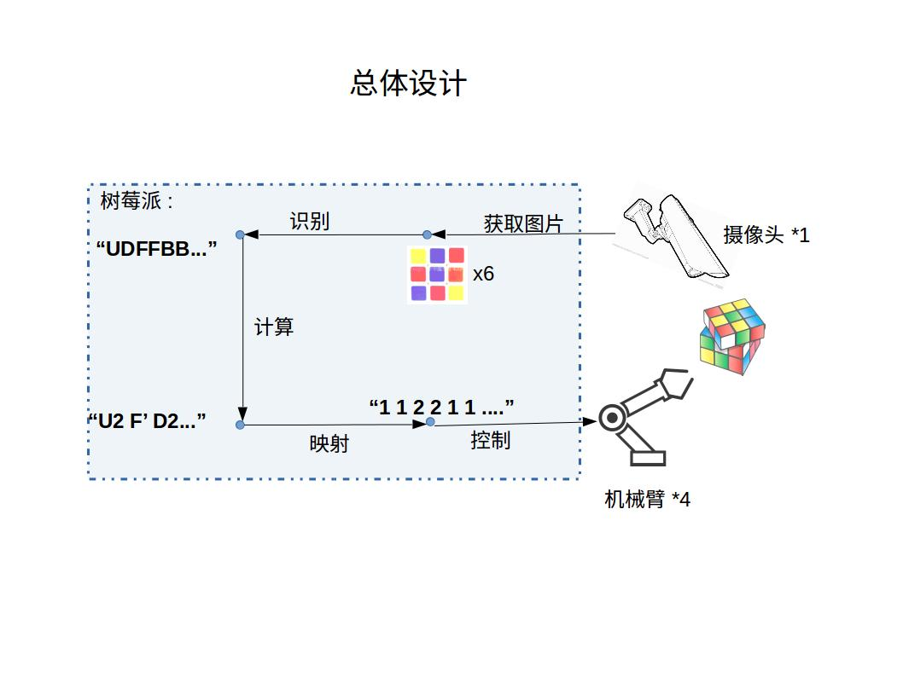
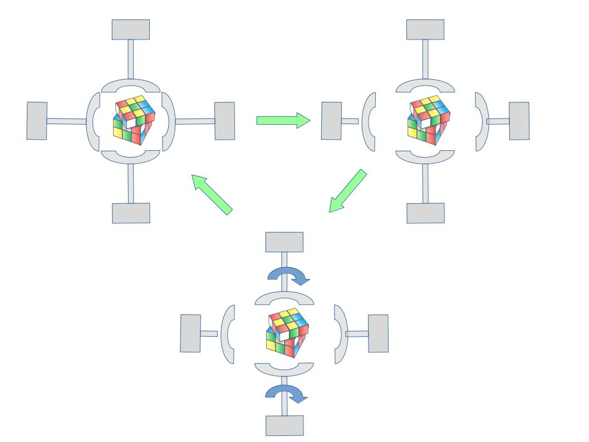

**总体设计**
----
	第一代6臂-3摄像头早已完成,但由于其需要破坏魔方结构且要求摄像头高度一致,我们打算做第二代--4臂-1摄像头.   
	整体框架如下图所示.三个核心硬件分别是树莓派,摄像头,机械臂.一开始,4个机械臂与1个摄像头自动配合,完成6个面的拍摄, 然后树莓派获取这6张图片.通过识别程序将图片转换为对应的编码,再通过一个计算程序将生成一个还原序列.需要注意的是, 这个还原序列指的是魔方的每个面应该按照什么样的顺序取旋转, 但是机械臂只有4个, 必须加上一个映射层才能够正确的控制机械臂.   
    
**进度**
----
在中期检查的时候,我们已经完成了机械部分的框架.在这一阶段我们先后解决了如下问题
*问题1* 我们采用的kociemba算法能够自动给出还原序列,大概是这样子的`FBFFb..`其中不同的字母代表魔方的6个面,大小写代表顺时针逆时针.而我们的机械臂只有4个,如果我需要旋转顶部的色块,我必须先用两个机械臂配合,让魔方的上面指向机器的侧面,然后在进行旋转,如下图所示.  
      
	另外,由于本次将魔方顶面转到了侧面,那么下一次旋转的时候应该如何确定魔方的顶面在哪个方向呢?
*解决1* 这个问题的关键在与要实时的知道魔方的每个面的指向,我们在代码中设置了一个动态字典,形如`{魔方面:方向}`每一次操作后都会自动更新这个字典,这样我就可以知道任意时刻,魔方任意面的指向了.知道了指向后,就进行一个分类,指向机器的X/Y轴是一类,直接旋转.指向Z轴的是一类,先把它转到X/Y方向,再进行旋转.相关代码在

